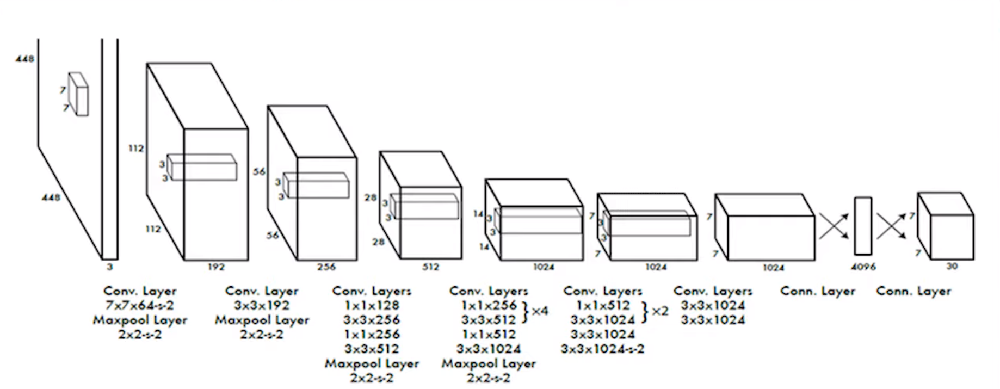

# Object Detection

Library of different object detection algorithms. You need a CUDA compatible GPU for this to work.

[](https://github.com/proafxin/object-detection/actions/workflows/trunk.yml)

[](https://github.com/proafxin/object-detection/actions/workflows/ci.yml)

[](https://codecov.io/gh/proafxin/object-detection)

## Development environment

This project uses trunk for linting and formatting. Check <https://trunk.io/products/check>

For dependency, `poetry` is used: <https://python-poetry.org/>

Go to root directory and run `poetry install`. But first make sure you have CUDA in your system along with all necessary packages. You can follow <https://github.com/proafxin/cuda-gpu-scripts> for CUDA related instructions. Make sure CUDA can interact with your GPU. The best way to ensure that is to go to python shell and run

```python
import torch
torch.cuda.is_available()
```

You should see `True` as output. Finally, for virtual environment management, automated testing and task management, `tox` is used: <https://tox.wiki/>

Install `tox` in your system using `python3 -m pip install -U tox` and then run `tox` from the project directory.

## Design philosophy for YOLO model implementation

The idea behind the structure in this package is that we want to make the model reusable and easily configurable.
We will say, a model consists of some `units`. Each such unit can consist of `layers` or `blocks` or `cells`.
Cell is an individual component such as Convolution, MaxPool, ReLU or other activation function, etc.
A block consists of some cells. Sometimes a single component is repeated multiple times.
To make it easy for us to specify the model, instead of adding the repeated components individually, we simply specify a repeition factor.
The same idea goes for a layer. A layer consists of some blocks which may be repeated.
The idea of `unit` may be confusing at first. First of all, it completely depends on the user. However, a good idea to make a separation would be at where we take maxpool. See the following figure:

Here, there is a maxpool after the first convolution. So that will be our first unit: convolution combined with maxpool. Same for second unit.
In third unit, we have 4 convolution and then maxpool.
In fourth unit, we have two convolutions which are repeated, then two convolutions and a maxpool layer, and so on.
